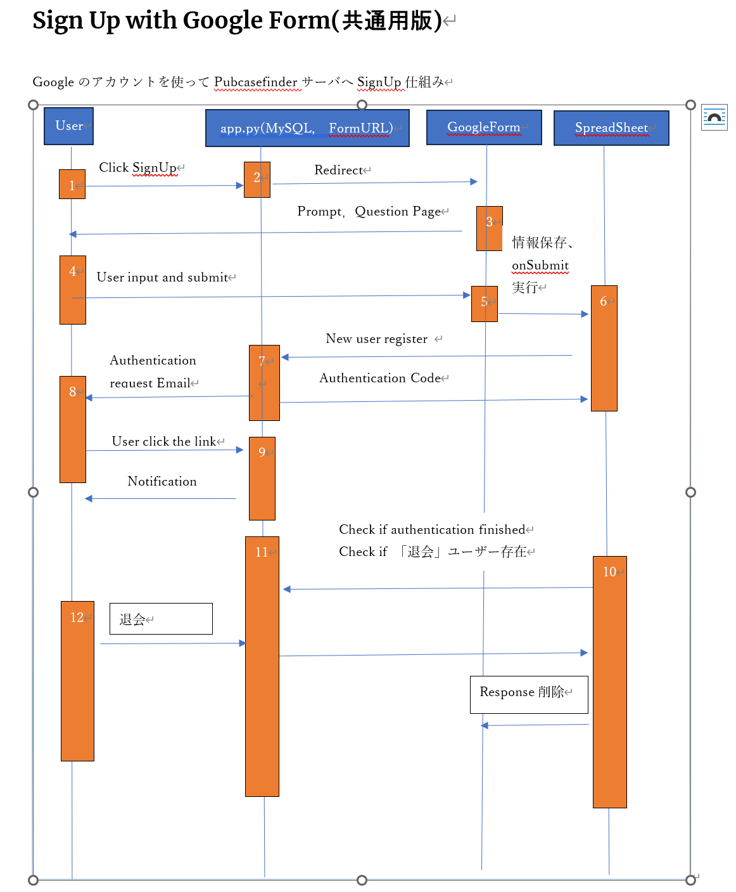
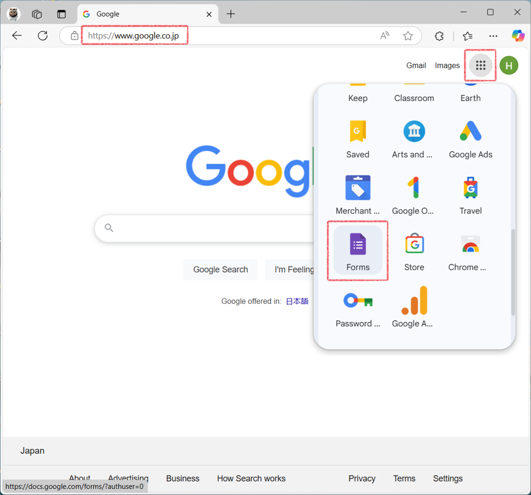
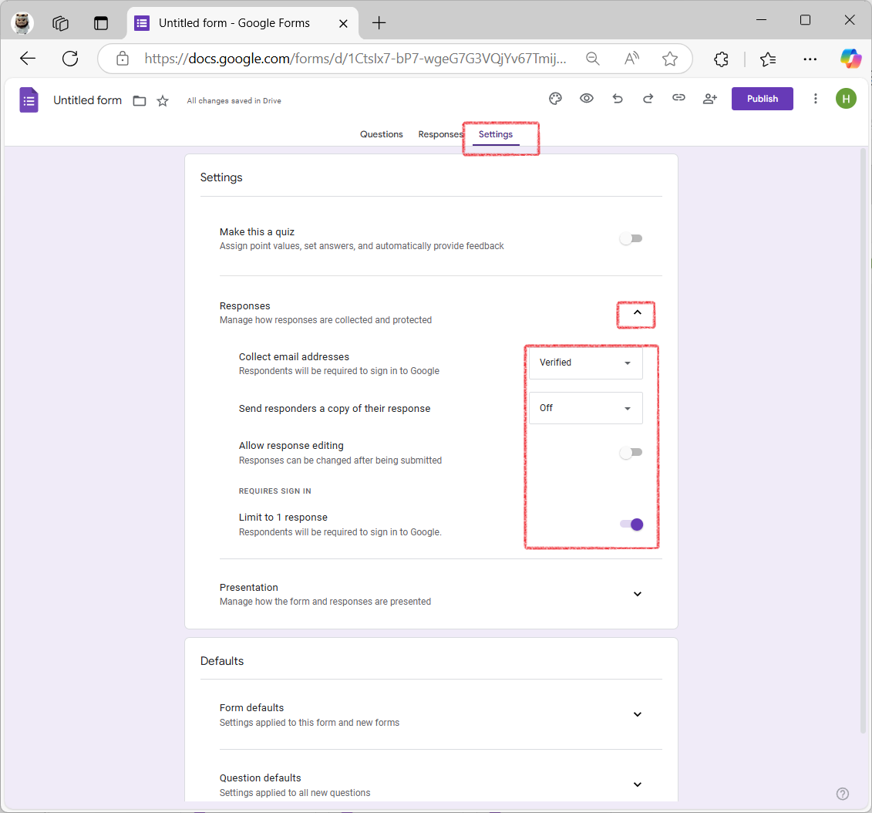
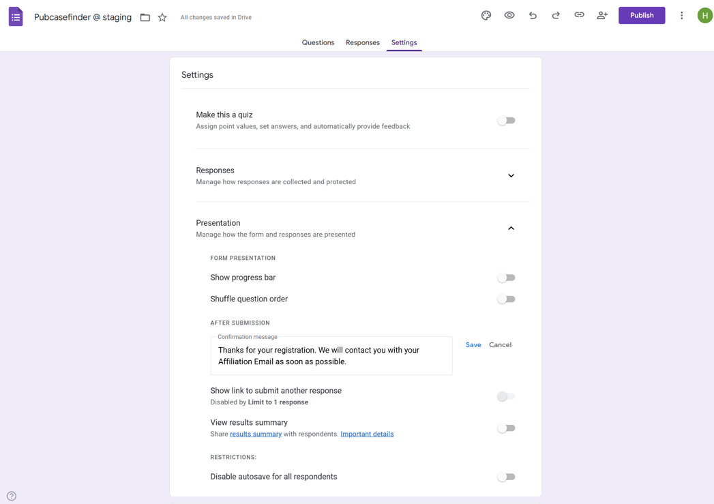
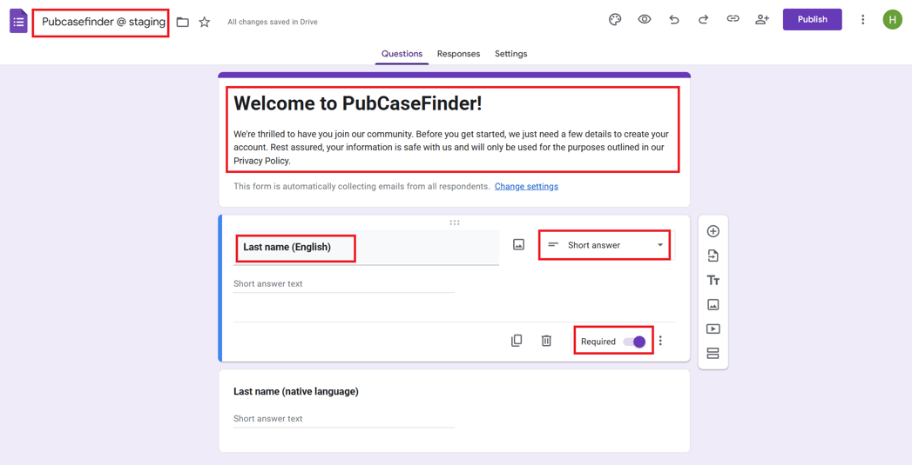
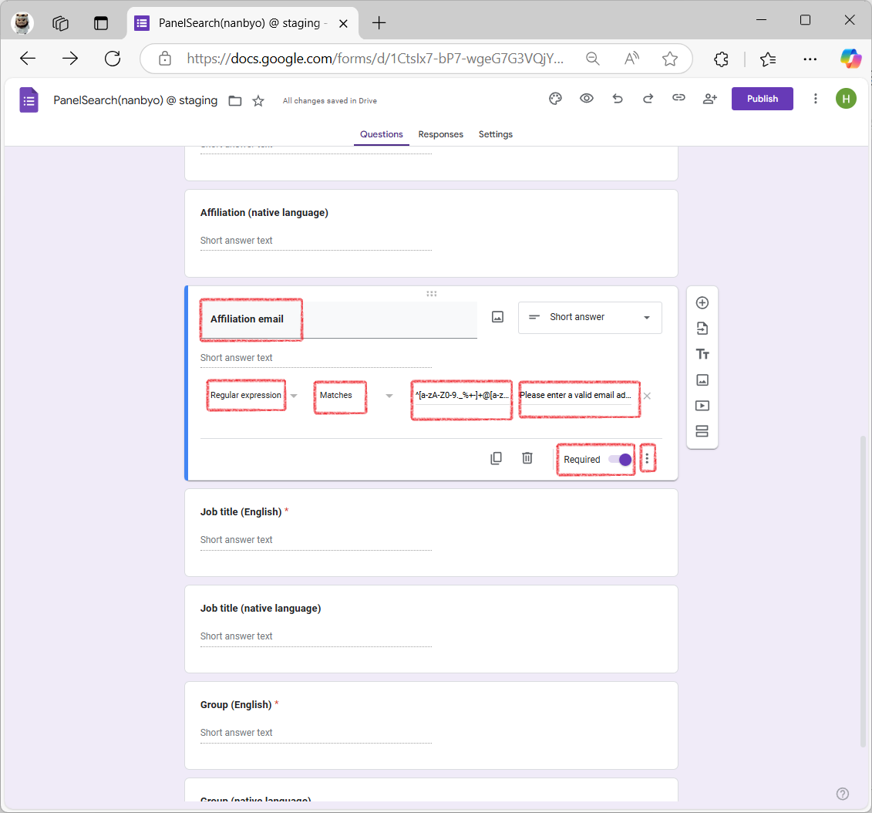
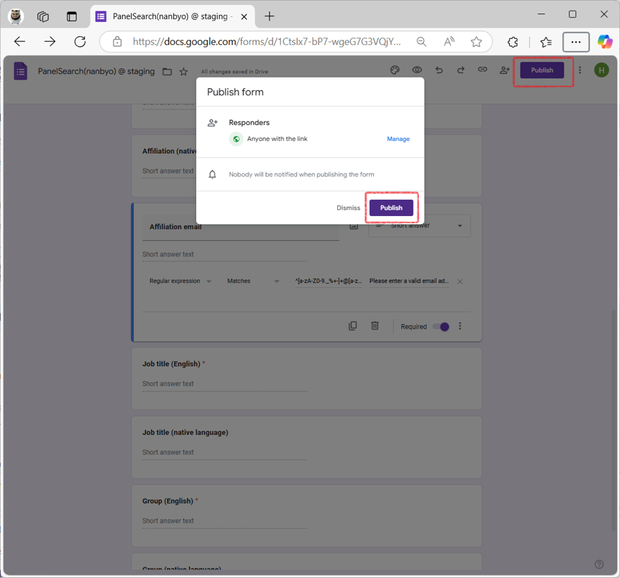
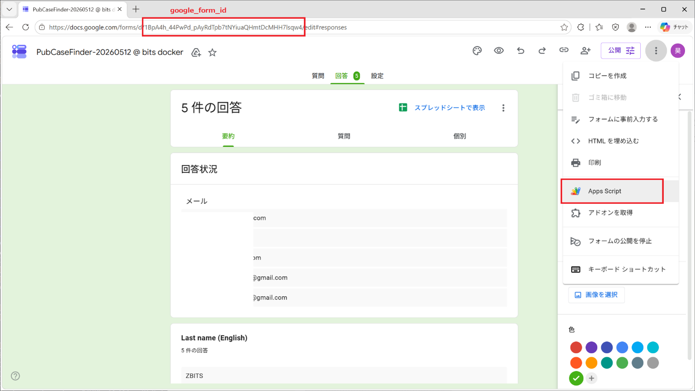
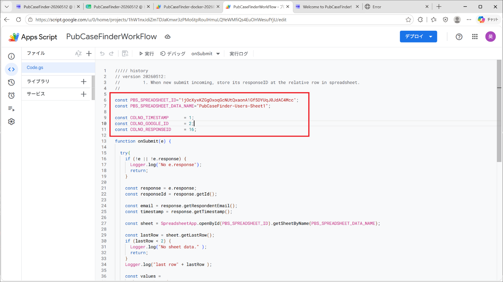
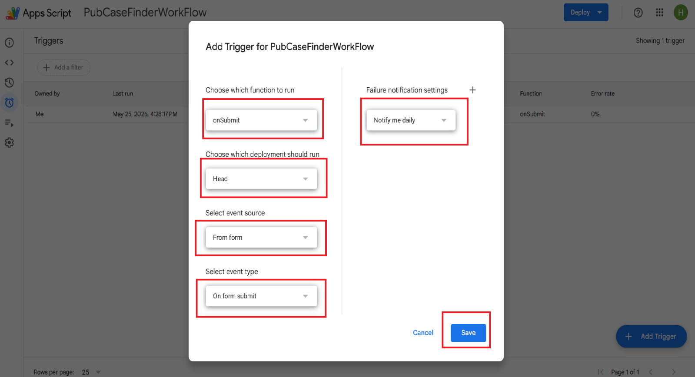

# 一、Sign Up With Google 仕組み

1.  Userが「Sign Up」をスタート

2.  Flask側、Configファイルに定義されたGoogle Form URLへRedirect

3.  Google Formをユーザー側へ帰す

4.  ユーザーが名前、メールアドレス、Affiliation,JobTitleなど入力して、Submitする

5.  Google
    Form側、ユーザー入力Responseを新規作成し、情報をGoogleFormのResponseListとGoogle
    SpreadsheetのSheet、二箇所に保存して、Google Formの「onSubmit Trigger」とGoogleSpreadsheetの「onSubmit Trigger」を自動的に呼び出す。
    Google Formの「onSubmit Trigger」は、このResponseのResponseIDをGoogle Spreadsheet該当行に保存

6.  GoogleSpreadsheetのSubmit
    Triggerを実行、Pubcasefinderサーバへユーザー新規追加を投げて

7.  Pubcasefinderサーバのインタフェースです。新ユーザーをMySQLのuser_accountテーブルへ登録、AuthenticationCodeを作成して、ユーザーのメールアドレスへAuthenticationメールを送信

8.  ユーザー側、Authenticationメール中のリンクをクリックして、Authenticationを行います。

9.  Pubcasefinderサーバで、ユーザーのAuthenticationを受けて、Account_authテーブルへ登録。ユーザーのメールアドレスへ登録成功のNotificationメールを送信する。

10. GoogleSpreadsheetのStatus Check
    Triggerを実行、定期的に、PubcasefinderサーバへAuthentication完了するかを確認する。

11. Pubcasefinderサーバで、ユーザーのAuthentication完了、「承認された」、「退会」などの状態変更を記録すする

12. ユーザーがPubcasefinderのWeb上、「退会」を行い

13. 10番のstatus check
    Triggerの実行で、Pubcasefinderサーバから、「退会」したユーザーのResponseIDでGoogleFormの該当ユーザーのResponseを削除する

# 二、例として、下のサーバのGoogleFormの作成を説明する。
「https://staging-pubcasefinder.dbcls.jp」

## 1. Google Formを新規作成

> ご利用のGoogle AccountでログインGoogleへアクセス

「Forms」というGoogle APPをクリックする

「Start a new form」をクリックする

## 2. Google Formの設定

「Settings」タブを選択し、「Responses」部分を設定する。

⁂「Make this a quiz」部分は押さないで

「Presentation」部分を設定する。特に、Confirmation message部分は編集する。

## 3. GoogleFormのQuestionの作成

「Questions」タブを選択、FormのTitleを編集、Formの各Questionを以下の順番で追加する。

  -----------------------------------------------------------------------
  **Title**               **Required**            **Validation**
  ----------------------- ----------------------- -----------------------
  Last name (English)     ON                      NO

  Last name (native       OFF                     NO
  language)                                       

  First name (English)    ON                      NO

  First name (native      OFF                     NO
  language)                                       

  Affiliation (English)   ON                      NO

  Affiliation (native     OFF                     NO
  language)                                       

  Affiliation email       ON                      YES

  Job title (English)     ON                      NO

  Job title (native       OFF                     NO
  language)                                       

                                                  

                                                  
  -----------------------------------------------------------------------

特に、「Affiliation email」部分は、下右の三点マックよりResponse validationを設定する。

- Regular expression
- Matches
- ^[a-zA-Z0-9._%+-]+@[a-zA-Z0-9.-]+\.[a-zA-Z]{2,}$
- **Please enter a valid email address!**

## 4.Google Form のPublish

FormをPublishする。

## 5. GoogleFormのLink

このFormのURLを表示して、保存する。「.env」ファイルへ設定する。

## 6.GoogleFormの「onSubmit Trigger」の作成

Google Form側、新規登録くる時、Google はユーザー入力した情報より、Responseを新規作成し、GoogleFormのResponseListとGoogleSpreadsheetのSheetに追加した後、GooleFormとGoogleSpreadsheetの「on Form Submit Trigger」を行う

ここは、GoogleFormの「onSubmit Trigger」を作成する。このTriggerは、該当ResponseのResponseIDをGoogleSpreadsheetのResponseID Columnへ保存する処理を行う。

図面のように、GoogleFormの編集画面を開けて、「google form id」を記録し、GAS編集画面を開ける

GASに、GithubにPUSHした「static/js/google-form-common.js」で、Scriptを設定する。Google
SpreadsheetのID、SpreadsheetのSheet名を設定する。COLNOの部分は、SpreadsheetのColumnの順番を一致する。保存。

onSubmit Triggerを追加

# 三、Google Spreadsheetの作成**

1\. Google Form Linked Google Spreadsheetを新規作成

{width="7.268055555555556in"
height="6.773611111111111in"}

Formへ関連するGoogle Spreadsheetを設定する。

{width="7.268055555555556in"
height="6.773611111111111in"}

Spreadsheetの名前を設定して、作成する

2.Google
Spreadsheetに自動的作成したColumnの後ろ、追加ColumnのHeaderを設定する。

{width="7.268055555555556in"
height="4.086111111111111in"}

ColumnのHeaderへ、以下のColumnを手動で追加する

**UID**

**AuthenticationCode**

**isEmailValid**

**isRegisted**

**ResponseID**

追加したColumnを確認する

3.  Google Spreadsheet のGASを編集する

{width="7.268055555555556in"
height="6.222916666666666in"}

Spreadsheetの機能を作ります。

{width="7.268055555555556in"
height="4.385416666666667in"}

GASに、GithubにPUSHした「static/js/google-spreadsheet-common.js」で、Scriptを設定する。

Codeの中身を確認する：

- **PUBCASEFINDER_WEB_SERVER**:

> PubcasefinderサーバのURL(例: https://
> staging-pubcasefinder.dbcls.jp/)を設定する。

- **PUBCASEFINDER_WEB_SERVER_SECRET_KEY**:

> Pubcasefinderサーバー側「.env」に「GOOGLE_FORM_SECRET_KEY」の値と一致

{width="7.268055555555556in"
height="2.2569444444444446in"}

- **PBS_SPREADSHEET_ID**：

> 例：以下の赤い部分
>
> https://docs.google.com/spreadsheets/d/**1evhGHU-Kpfhtm94DCL0KHMN5ljHEV2rRnrCHCy8B_WQ**/edit..

- **PBS_SPREADSHEET_DATA_NAME**：

> Spreadsheetのsheetの名前を「PubCaseFinder-Users-Sheet1」に設定する

- **PBS_GOOGLEFORM_ID**：

> 二の6に記録したgoogle form id をここに設定する

CodeのCOLNOの部分は、Spreadsheetの各Columnの順番を一致する

4.  Triggerを設定する

{width="7.268055555555556in"
height="5.200694444444444in"}

Triggerを設定する。

(1)「onOpen Trigger」:

GoogleSpreadsheetの画面にMENUを追加する用

{width="7.268055555555556in"
height="5.200694444444444in"}

管理用Menu作成Triggerを追加

{width="6.266666666666667in"
height="4.083333333333333in"}

初めて場合、認証を行います。

{width="5.0004330708661415in"
height="4.700406824146982in"}

{width="5.222490157480315in"
height="4.903029308836396in"}

{width="6.2672101924759405in"
height="7.192290026246719in"}

{width="7.268055555555556in"
height="5.200694444444444in"}

Menu用Triggerを作成しました。

(2)「on Form Submit Trigger」の作成

Google Form側、新規登録きっだ場合、データは

{width="7.268055555555556in"
height="4.680555555555555in"}

Google FormをSubmit 時のTriggerを作成

{width="7.268055555555556in"
height="4.402777777777778in"}

\(3\) GAS, Check Status Triggerを追加する

このTriggerは、定期的に、Pubcasefinderのサーバから、ユーザーの状態変更を取って、処理を行う。

退会したユーザーは、Google
FormのReponseListから、該当Responseを削除処理を行う

{width="7.268055555555556in"
height="3.6013888888888888in"}

Check Status Triggerを追加. 「Select type of time based
trigger」と「Select hour
interval」部分は、SpreadsheetからPubcasefinderのサーバへアクセスし、状態変更したのユーザーを取る処理の頻度を定義する。ご自由にお使いください。

\(4\) ユーザーAuthentication　Expiration　Check　Triggerを作成

{width="7.268055555555556in"
height="4.277777777777778in"}

