# Google Form サインアップシステム（Panelsearch/Nanbyo 版）

## Prerequisites
- Domain Name of the Flask Server(例：https://staging-pubcasefinder.dbcls.jp)
- Google Account(Google FormとSpreadsheet作成用)
- GOOGLE_FORM_SECRET_KEY(from flask configure file(.env))

---

## 一、システム仕組み

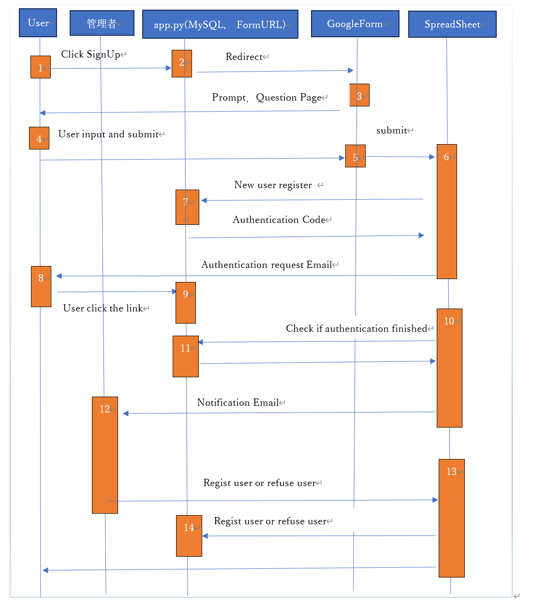

### 処理フロー

| ステップ | 処理内容 | 説明 |
|:---:|---|---|
| 1 | ユーザー操作 | Userが「Sign Up」をスタート |
| 2 | Flask処理 | Configファイルに定義されたGoogle Form URLへリダイレクト |
| 3 | 画面表示 | Google Formをユーザー側へ表示 |
| 4 | ユーザー入力 | 名前、メールアドレス、Affiliation、JobTitle、Groupなどを入力してSubmit |
| 5 | Google Form処理 | Google Form側情報を保存し、Google Spreadsheetの「Submit Trigger」を自動呼出し |
| 6 | Spreadsheet Trigger | Google SpreadsheetのSubmit Triggerを実行、Pubcasefinderサーバへユーザー新規追加をリクエスト、AuthenticationCodeを取得しユーザーへ認証メール送信 |
| 7 | サーバー処理① | Pubcasefinderサーバのインタフェースで新ユーザーをMySQL `Account_auth` テーブルへ登録、AuthenticationCodeを作成してGoogleSpreadsheetへ返却 |
| 8 | ユーザー操作 | ユーザーが認証メール中のリンクをクリックしてAuthenticationを実施 |
| 9 | サーバー処理② | PubcasefinderサーバでユーザーのAuthenticationを受けて `Account_auth` テーブルへ登録 |
| 10 | 定期チェック① | Google SpreadsheetのAuthentication Check Triggerを実行、定期的にPubcasefinderサーバへAuthentication完了状態を確認。完了したものがあれば管理者へNotificationメール送信 |
| 11 | 状態確認 | PubcasefinderサーバのインタフェースでユーザーのAuthentication状態を返す |
| 12 | 管理者審査 | 管理者がNotificationメールを受信、Google Spreadsheetのサイトへアクセスし、画面のMenuより新規ユーザー登録をYES/NOで判定 |
| 13 | 管理者決定 | Google SpreadsheetのMenu機能で管理者の決定を実行、Pubcasefinderサーバとユーザーへ反映 |
| 14 | 登録完了 | ユーザー登録または拒否が完了 |

---

## 二、Google Form 作成手順（Panelsearch/Nanbyo 用）

> 以下、`https://staging-pubcasefinder.dbcls.jp` サーバの panelsearch(nanbyo) 用を例として説明します。

---

### 1. Google Formを新規作成

ご利用のGoogle AccountでログインしGoogleへアクセス, 「Forms」というGoogle APPをクリック
   

「Start a new form」をクリック
   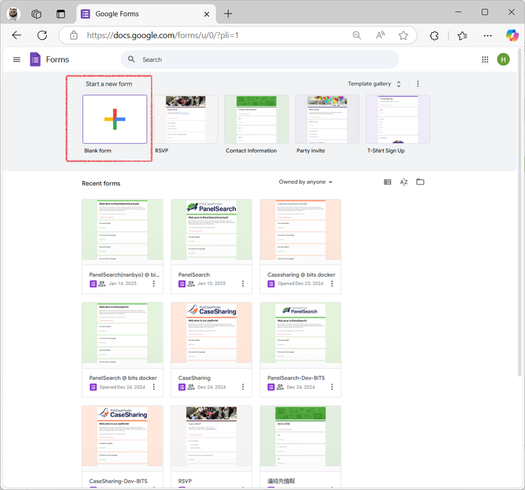

---

### 2. Google Formの設定

#### Settingsタブの設定

**Responses部分：**
- 「Make this a quiz」は**オンにしない**でください

**Presentation部分：**
- Confirmation messageを編集する
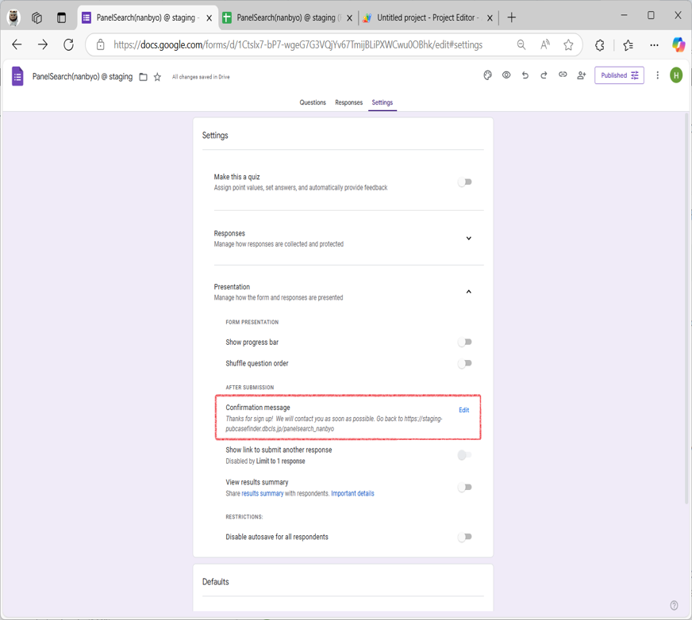

---

### 3. Google FormのQuestion作成

「Questions」タブを選択し、FormのTitleを編集後、以下の順序で質問を追加します。
| # | Title | Required | Validation |
|:-:|---|---|:---:|
| 1 | 苗字 | ✅ ON | ❌ NO |
| 2 | Last name (English) | ✅ ON | ❌ NO |
| 3 | 名前 | ✅ ON | ❌ NO |
| 4 | First name (English) | ✅ ON | ❌ NO |
| 5 | 所属機関・部署 | ✅ ON | ❌ NO |
| 6 | **所属機関のメールアドレス** | ✅ ON | ✅ **YES** |
| 7 | 職名 | ✅ ON | ❌ NO |

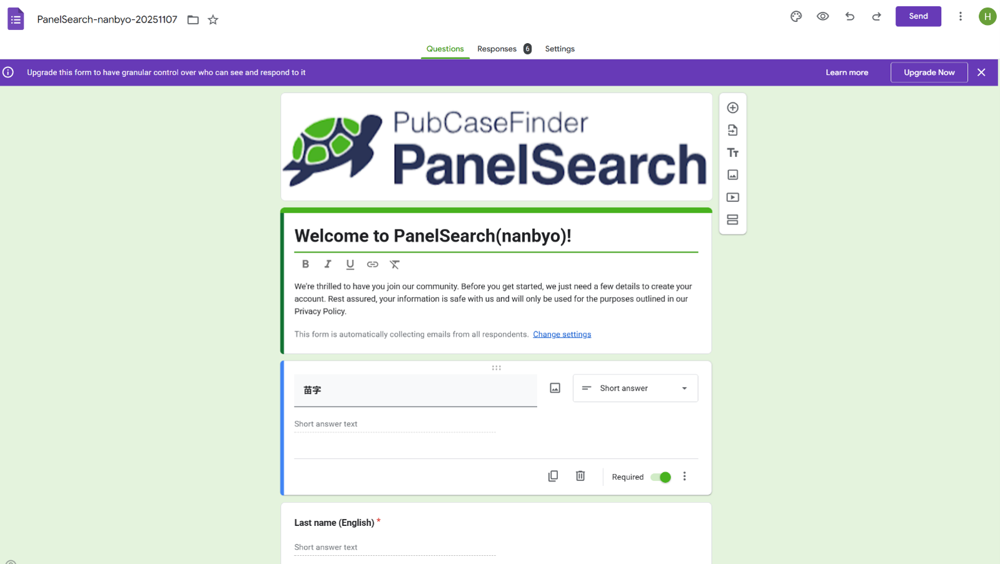

#### メールアドレス検証設定

「**所属機関のメールアドレス**」フィールドについては、右下の三点マーク（⋮）より**Response validation**を設定します。
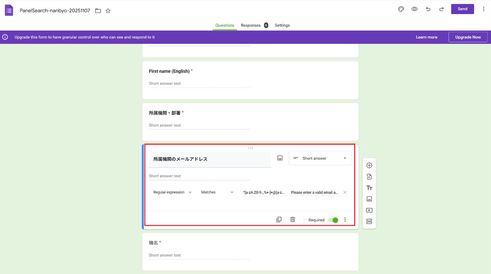

| 設定項目 | 値 |
|---|---|
| タイプ | Regular expression |
| 条件 | Matches |
| 正規表現 | `^[a-zA-Z0-9._%+-]+@[a-zA-Z0-9.-]+\.[a-zA-Z]{2,}$` |
| エラーメッセージ | `Please enter a valid email address!` |

---

### 4. Google Form のPublish

フォームを公開（Publish）します。

---

### 5. Google FormのURL取得

フォームのURLを表示して保存します。
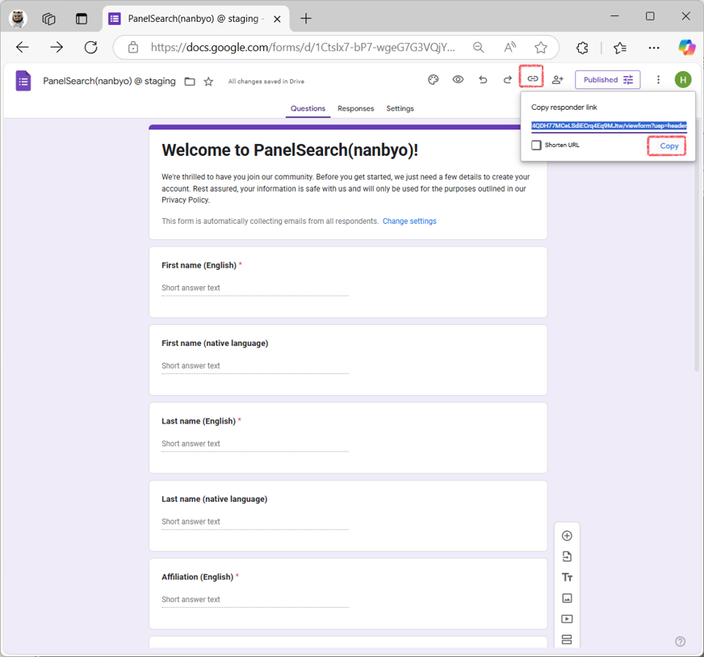

> 📌 このURLを `.env` ファイルのGOOGLE_FORM_URL_PSNへ設定します。

---

## 三、Google Spreadsheet 作成手順

---

### 1. Google Form連携Spreadsheetを新規作成

フォームに関連するGoogle Spreadsheetを設定します。

Spreadsheetの名前を設定して作成します。
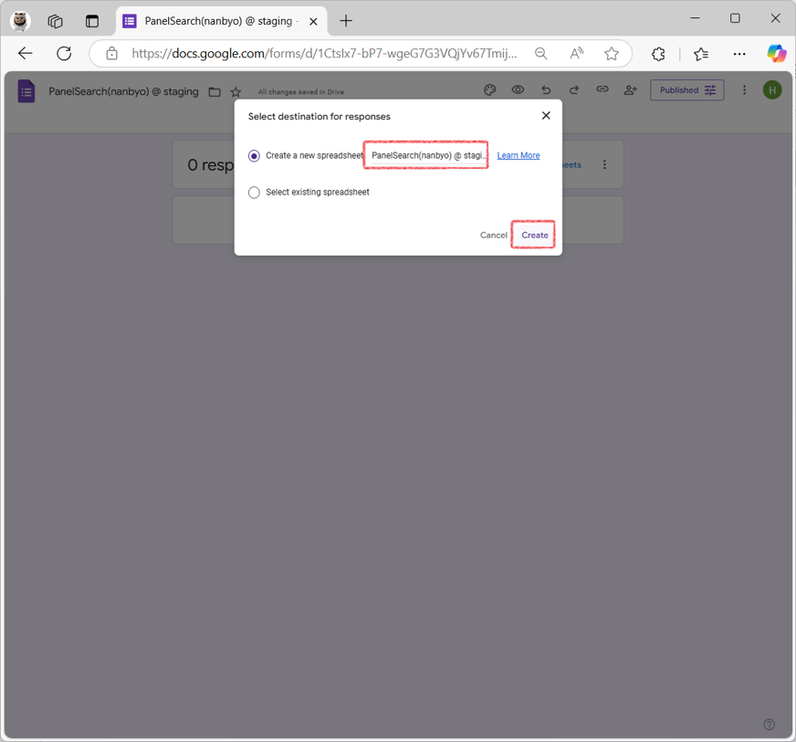

---

### 2. カラムを新規追加

Spreadsheetに自動生成されたカラムの後ろに、以下の追加カラムを手動で設定します。

| 追加カラム名 |
|---|
| **UID** |
| **AuthenticationCode** |
| **isEmailValid** |
| **isRegisted** |

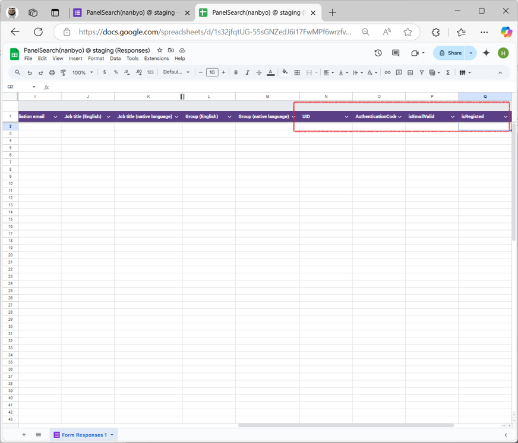

> ✅ 追加したColumnを確認します。

---

### 3. Google Spreadsheet のGASを編集

#### GASエディタを開く

#### Script設定

GASに、GithubにPUSHした `static/js/panelsearch_nanbyo/google-spreadsheet-panelsearch-nanbyo.js` でScriptを設定します。
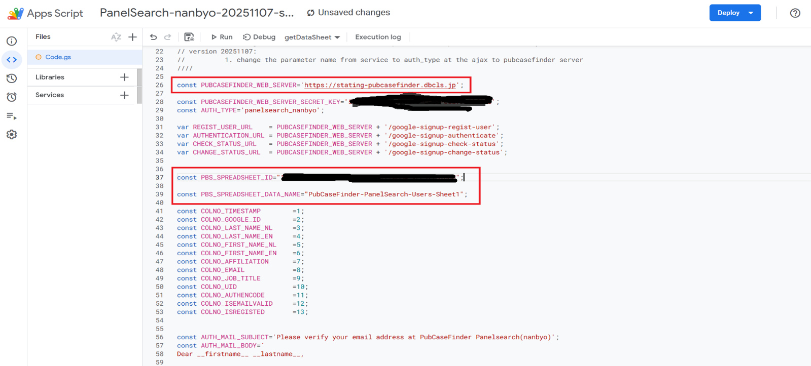

##### 設定変数一覧

| 変数名 | 説明 | 設定例 |
|---|---|---|
| `PUBCASEFINDER_WEB_SERVER` | PubcasefinderサーバのURL | `https://staging-pubcasefinder.dbcls.jp/` |
| `PUBCASEFINDER_WEB_SERVER_SECRET_KEY` | サーバー側`.env`の`GOOGLE_FORM_SECRET_KEY`と一致させる | — |
| `PBS_SPREADSHEET_ID` | SpreadsheetのID（URLの赤色部分） | `1kss4hHDajL0dxoeXO8qO8hpUruElcsdt_61RNMhqvFo` |
| `PBS_SPREADSHEET_DATA_NAME` | Spreadsheetのシート名 | `PubCaseFinder-PanelSearch-Users-Sheet1` |
| `COLNO_XXX` | Spreadsheetの各Columnの順番と一致させる | — |
| `NOTIFICATION_MAIL_ACCOUNT` | 通知用管理者Emailアドレス | — |

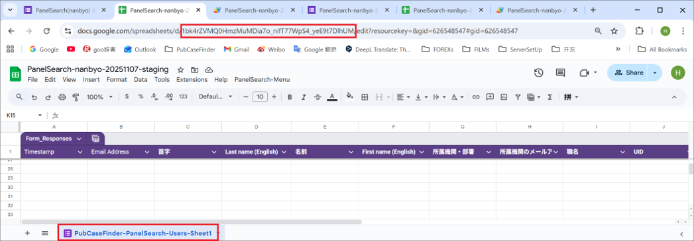  
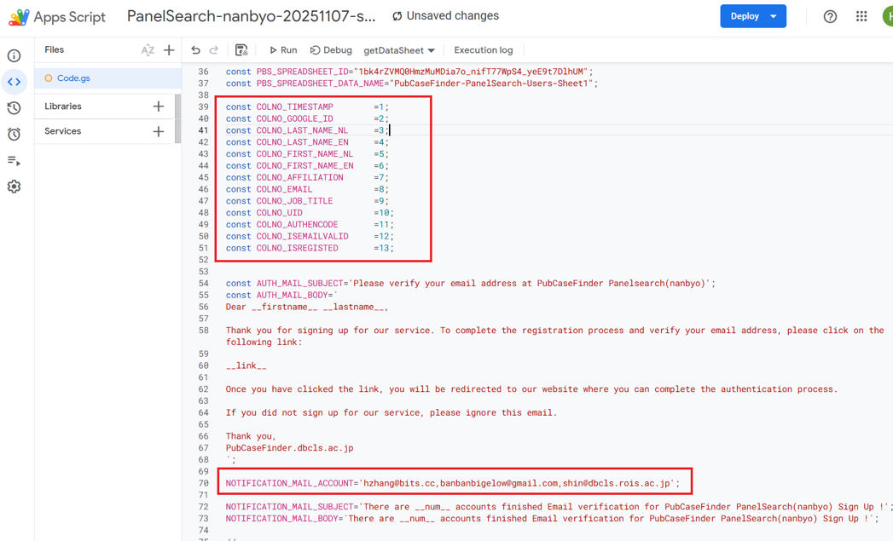  

> ⚠️ **注意：** Code内のCOLNOはSpreadsheetの各Columnの順番と一致させる必要があります。

---

### 4. Triggerを設定する

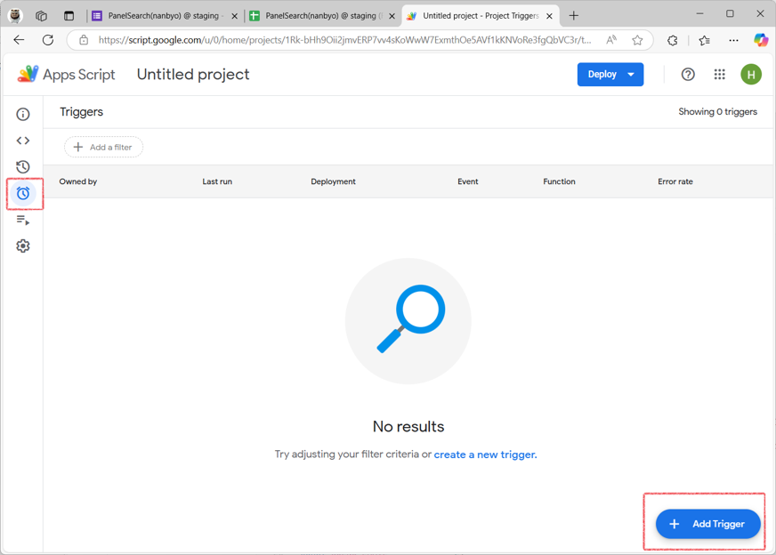

---

#### ① onOpen Trigger（メニュー追加用）

Google Spreadsheetの画面に管理用MENUを追加します。

##### 初回認証

初回実行時は認証が必要です。

| 認証手順 | 画面 |
|---|---|
| 認証① | 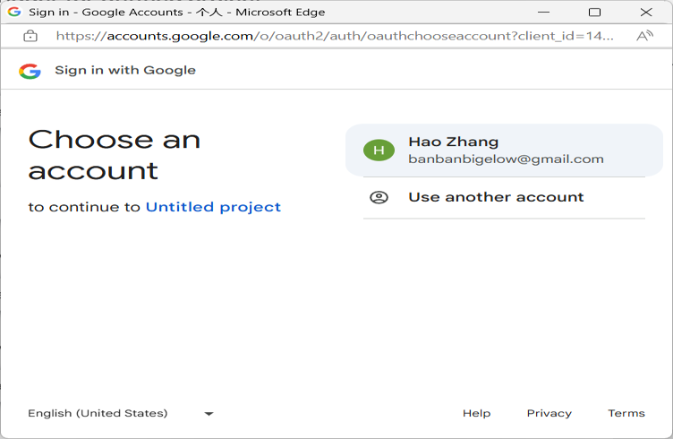 |
| 認証② |  |
| 認証③ |  |
| 認証④ | 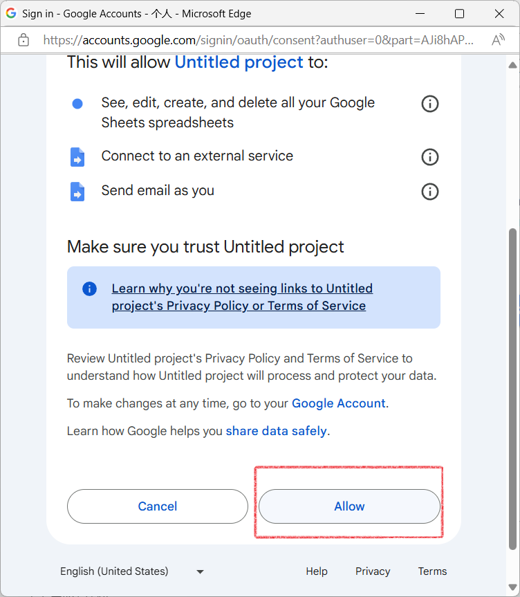 |

 

> ✅ Menu用Triggerが作成されました。

---

#### ② on Form Submit Trigger

Google Form送信時のTriggerを作成します。

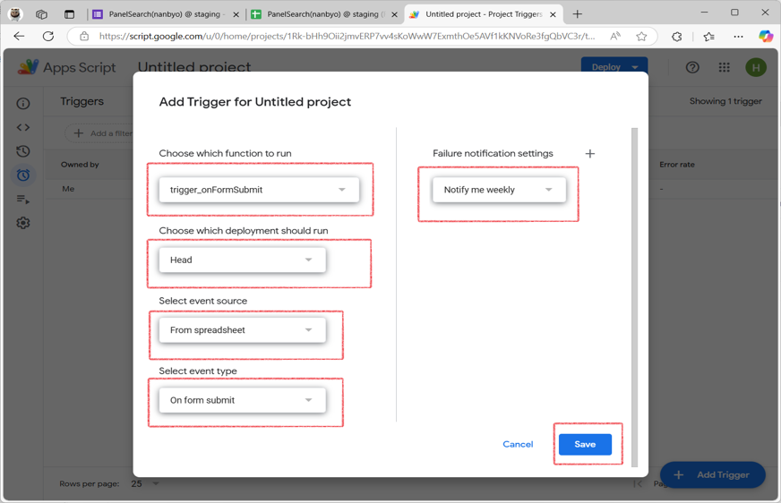

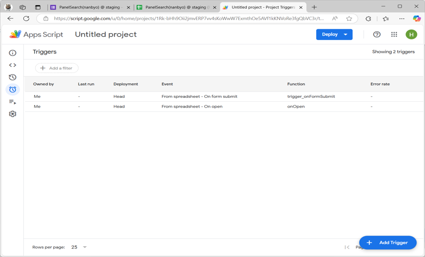

---

#### ③ Check Status Trigger（定期チェック用）

Status Check Triggerを作成します。

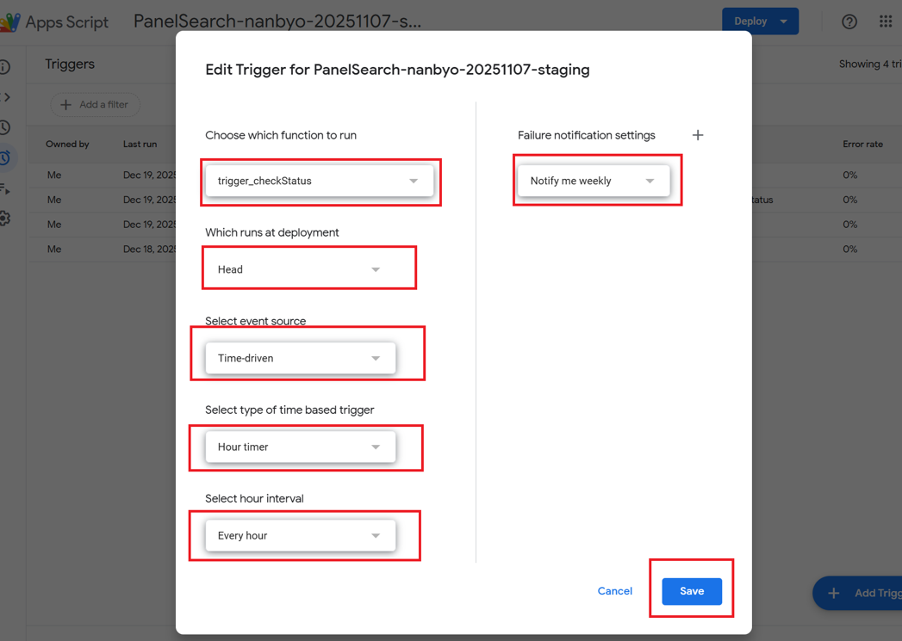

---

#### ④ 管理者通知メール送信Trigger

管理者へNotificationメールを送信するTriggerを作成します。

---

#### ⑤ Authentication Expiration Check Trigger

ユーザー認証の有効期限をチェックするTriggerを作成します。

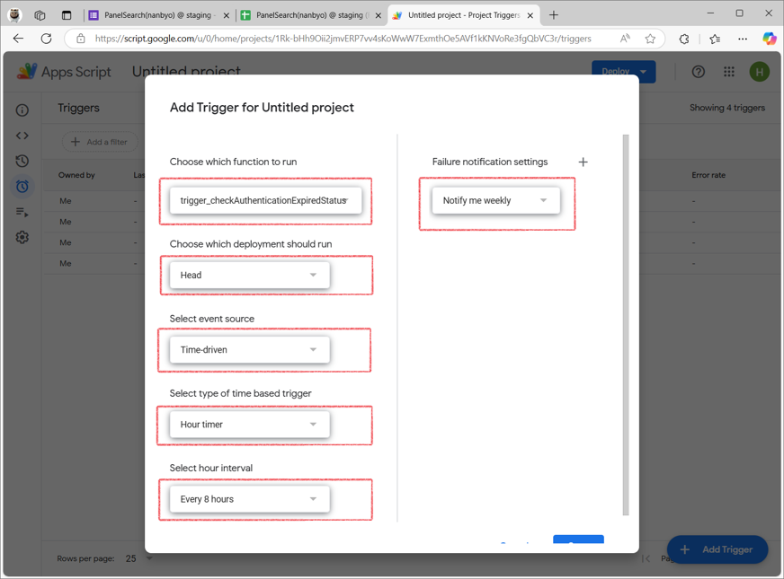

---

## 設定完了

✅ すべてのTriggerが設定されました  
✅ Google FormのURLを記録して、`.env`設定ファイルに設定します

### 設定チェックリスト

- [ ] Google Form作成・公開済み
- [ ] 各Question（7項目）を正しく設定
- [ ] 所属機関のメールアドレスにバリデーション設定
- [ ] .envにGoogle Form URLを設定
- [ ] Spreadsheetに追加カラム（4項目）を追加
- [ ] SpreadsheetのGAS変数を正しく設定
- [ ] onOpen Trigger設定（メニュー追加）
- [ ] on Form Submit Trigger設定
- [ ] Check Status Trigger設定
- [ ] 管理者通知メール送信Trigger設定
- [ ] Authentication Expiration Check Trigger設定

