# Google Form サインアップシステム

## Prerequisites
- Domain Name of the Flask Server(例：https://staging-pubcasefinder.dbcls.jp)
- Google Account(Google FormとSpreadsheet作成用)
- GOOGLE_FORM_SECRET_KEY(from flask configure file(.env))

---

## 一、システム仕組み


### 処理フロー

| ステップ | 処理内容 | 説明 |
|:---:|---|---|
| 1 | ユーザー操作 | Userが「Sign Up」をスタート |
| 2 | Flask処理 | Configファイルに定義されたGoogle Form URLへリダイレクト |
| 3 | 画面表示 | Google Formをユーザー側へ表示 |
| 4 | ユーザー入力 | 名前、メールアドレス、Affiliation、JobTitleなど入力してSubmit |
| 5 | Google Form処理 | ユーザー入力Responseを新規作成し、以下の2箇所に保存：<br>• Google FormのResponseList<br>• Google SpreadsheetのSheet<br><br>さらに以下のTriggerを自動呼出し：<br>• Google Formの「onSubmit Trigger」<br>• Google Spreadsheetの「onSubmit Trigger」<br><br>※ Google FormのTriggerはResponseIDをSpreadsheet該当行に保存 |
| 6 | Spreadsheet Trigger | GoogleSpreadsheetのSubmit Triggerを実行、Pubcasefinderサーバへユーザー新規追加をリクエスト |
| 7 | サーバー処理① | Pubcasefinderサーバのインタフェースで新ユーザーをMySQL `user_account` テーブルへ登録、AuthenticationCodeを作成してユーザーのメールアドレスへ認証メールを送信 |
| 8 | ユーザー操作 | ユーザーが認証メール中のリンクをクリックしてAuthenticationを実施 |
| 9 | サーバー処理② | PubcasefinderサーバでユーザーのAuthenticationを受けて `Account_auth` テーブルへ登録、ユーザーのメールアドレスへ登録成功のNotificationメールを送信 |
| 10 | 定期チェック | GoogleSpreadsheetのStatus Check Triggerを実行、定期的にPubcasefinderサーバへAuthentication完了状態を確認 |
| 11 | 状態管理 | PubcasefinderサーバでユーザーのAuthentication完了、「承認された」、「退会」などの状態変更を記録 |
| 12 | ユーザー操作 | ユーザーがPubcasefinderのWeb上で「退会」を実施 |
| 13 | 連携処理 | 10のStatus Check Trigger実行時、Pubcasefinderサーバから「退会」したユーザーのResponseIDを取得し、GoogleFormの該当ユーザーResponseを削除 |

---

## 二、Google Form 作成手順

> 以下、`https://staging-pubcasefinder.dbcls.jp` を例として説明します。

---

### 1. Google Formを新規作成

1. ご利用のGoogle AccountでログインしGoogleへアクセス,「Forms」というGoogle APPをクリック
   

2. 「Start a new form」をクリック
   


---

### 2. Google Formの設定

#### Settingsタブの設定
  

**Responses部分：**
- 「Make this a quiz」は**オンにしない**でください

**Presentation部分：**
- Confirmation messageを編集する


---

### 3. Google FormのQuestion作成

「Questions」タブを選択し、FormのTitleを編集後、以下の順序で質問を追加します。

  

| # | Title | Required | Validation |
|:-:|---|---|:---:|
| 1 | Last name (English) | ✅ ON | ❌ NO |
| 2 | Last name (native language) | ❌ OFF | ❌ NO |
| 3 | First name (English) | ✅ ON | ❌ NO |
| 4 | First name (native language) | ❌ OFF | ❌ NO |
| 5 | Affiliation (English) | ✅ ON | ❌ NO |
| 6 | Affiliation (native language) | ❌ OFF | ❌ NO |
| 7 | **Affiliation email** | ✅ ON | ✅ **YES** |
| 8 | Job title (English) | ✅ ON | ❌ NO |
| 9 | Job title (native language) | ❌ OFF | ❌ NO |

#### メールアドレス検証設定


「**Affiliation email**」フィールドについては、右下の三点マーク（⋮）より**Response validation**を設定します。


| 設定項目 | 値 |
|---|---|
| タイプ | Regular expression |
| 条件 | Matches |
| 正規表現 | `^[a-zA-Z0-9._%+-]+@[a-zA-Z0-9.-]+\.[a-zA-Z]{2,}$` |
| エラーメッセージ | `Please enter a valid email address!` |

---

### 4. Google Form のPublish

フォームを公開（Publish）します。


---

### 5. Google Form のURLを取得
Google FormのURLを表示して保存します。
  
> 📌 このURLを `.env` ファイルの `GOOGLE_FORM_URL_PCF` へ設定します。

---

### 6. URLからGoogle Form IDを取得

  
上のように、Google Form IDを取得

---

### 7. Google Formの「onSubmit Trigger」作成

Google Form側で新規登録が発生すると、以下の流れで処理が行われます：

1. Googleがユーザー入力情報よりResponseを新規作成
2. Google FormのResponseListとGoogle SpreadsheetのSheetに追加
3. Google FormとGoogle Spreadsheetの「on Form Submit Trigger」を実行

ここでは**Google Formの「onSubmit Trigger」** を作成します。  
このTriggerは、該当Responseの**ResponseID**をGoogle SpreadsheetのResponseID Columnへ保存します。

#### 手順

1. Google Formの編集画面を開き、「google form id」を記録

   

2. GAS編集画面を開く

3. GASに、GithubにPUSHした `static/js/google-form-common.js` でScriptを設定

   **合わせる項目：**
   - Google SpreadsheetのID
   - SpreadsheetのSheet名
   - COLNO（SpreadsheetのColumn順番と一致させる）

4. 保存後、onSubmit Triggerを追加

   


---

## 三、Google Spreadsheet 作成手順

---

### 1. Google Form連携Spreadsheetを新規作成

フォームに関連するGoogle Spreadsheetを設定します。
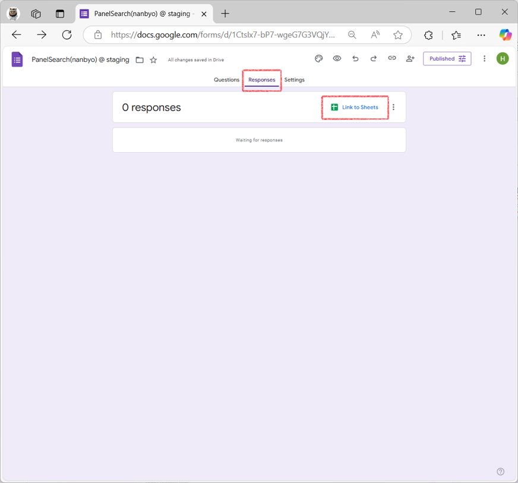

Spreadsheetの名前を設定して作成します。


---

### 2. カラムを新規追加

Spreadsheetに自動生成されたカラムの後ろに、以下の追加カラムを手動で設定します。

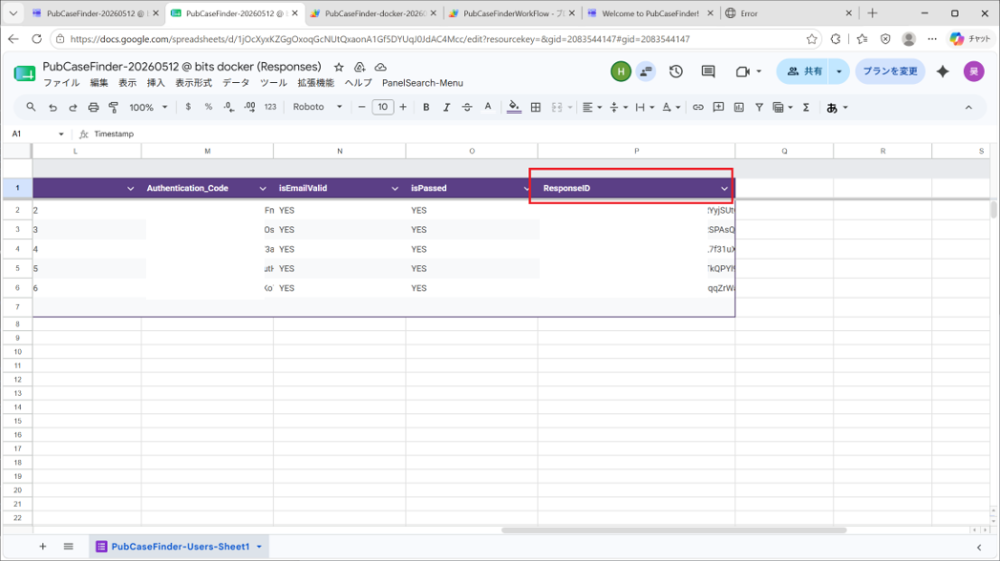

| 追加カラム名 |
|---|
| **UID** |
| **AuthenticationCode** |
| **isEmailValid** |
| **isRegisted** |
| **ResponseID** |

---

### 3. Google Spreadsheet のGASを編集

#### GASエディタを開く
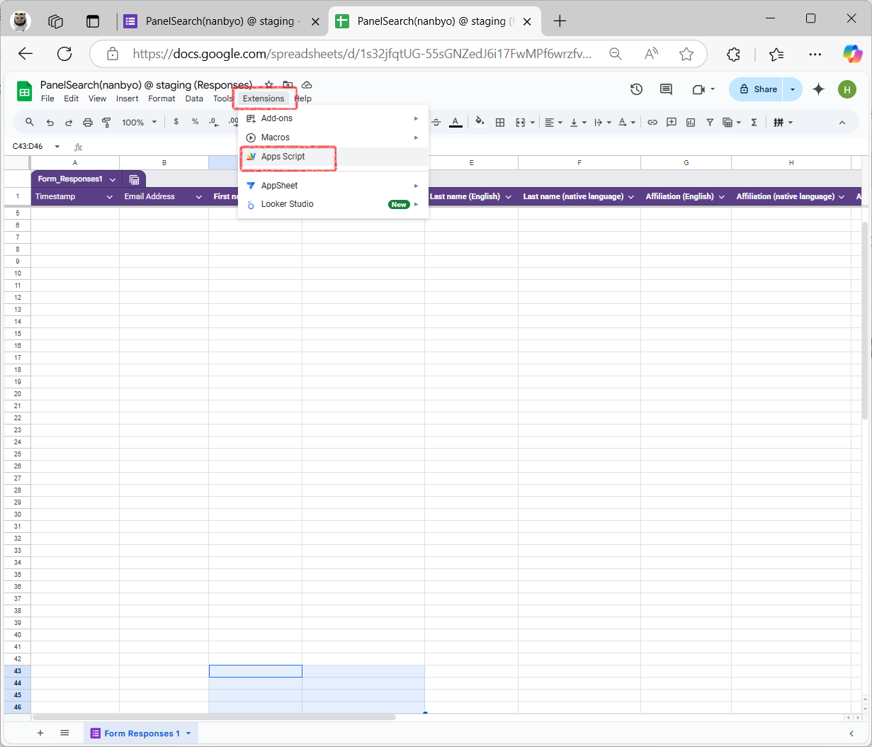

#### Script設定

GASに、GithubにPUSHした `static/js/google-spreadsheet-common.js` でScriptを設定します。
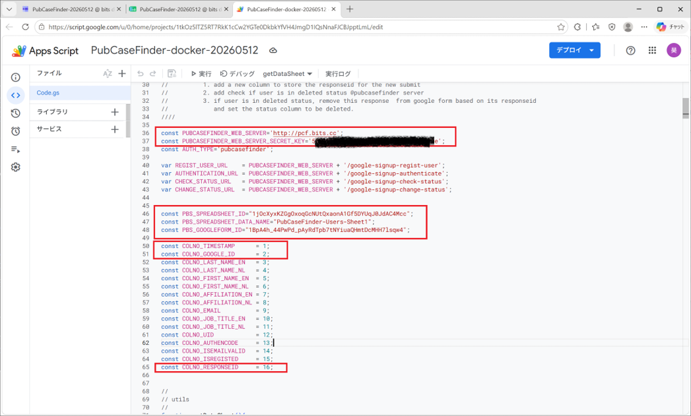

##### 設定変数一覧

| 変数名 | 説明 | 設定例 |
|---|---|---|
| `PUBCASEFINDER_WEB_SERVER` | PubcasefinderサーバのURL | `https://staging-pubcasefinder.dbcls.jp/` |
| `PUBCASEFINDER_WEB_SERVER_SECRET_KEY` | サーバー側`.env`の`GOOGLE_FORM_SECRET_KEY`と一致させる | — |
| `PBS_SPREADSHEET_ID` | SpreadsheetのID（URLの`[]`部分） | `1evhGHU-Kpfhtm94DCL0KHMN5ljHEV2rRnrCHCy8B_WQ` |
| `PBS_SPREADSHEET_DATA_NAME` | Spreadsheetのシート名 | `PubCaseFinder-Users-Sheet1` |
| `PBS_GOOGLEFORM_ID` | 二-5で記録したGoogle Form ID | — |

ID設定例
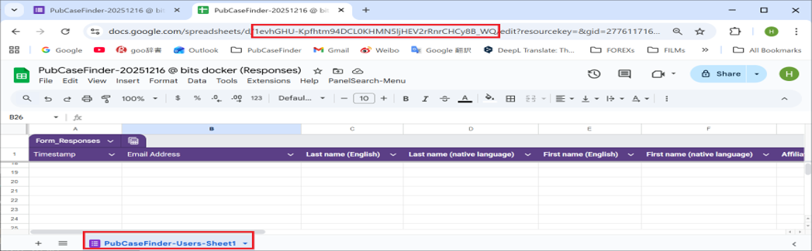

> ⚠️ **注意：** Code内のCOLNOはSpreadsheetの各Columnの順番と一致させる必要があります。

---

### 4. Triggerを設定する


---

#### ① onOpen Trigger（メニュー追加用）

Google Spreadsheetの画面に管理用MENUを追加します。
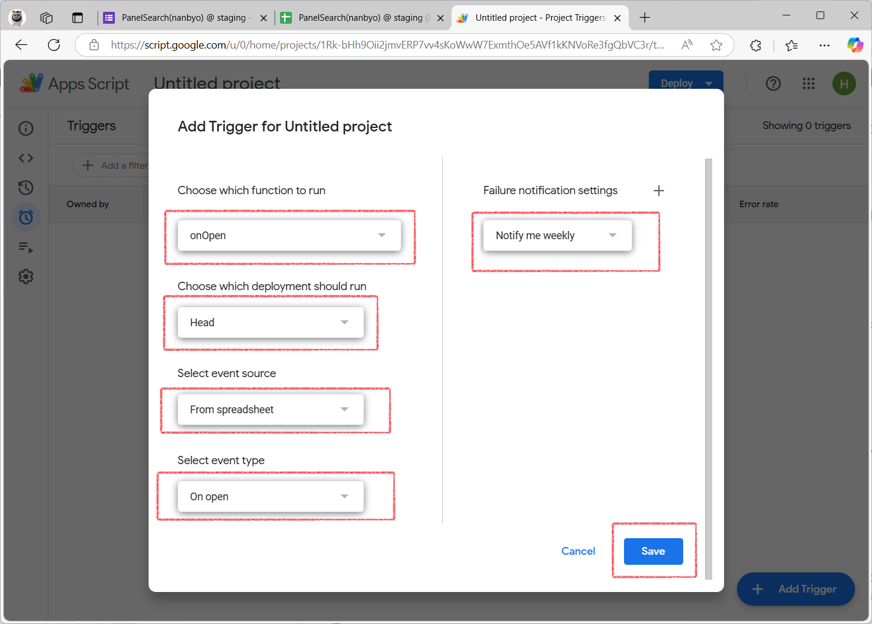

##### 初回認証

初回実行時は認証が必要です。

| 認証手順 | 画面 |
|---|---|
| 認証① | 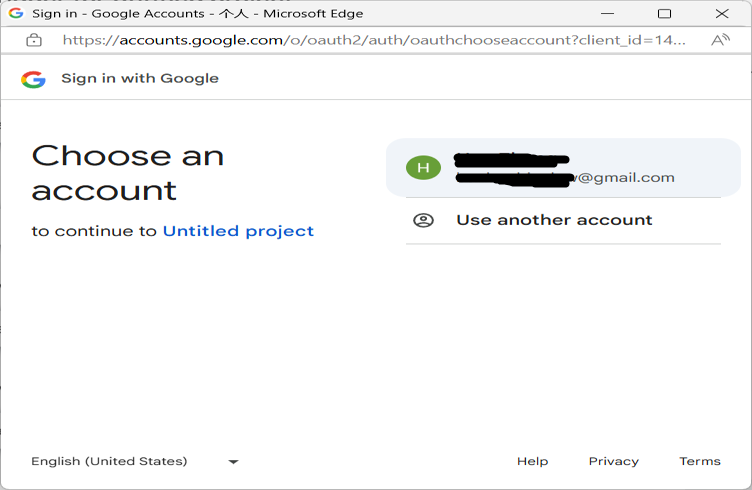 |
| 認証② | 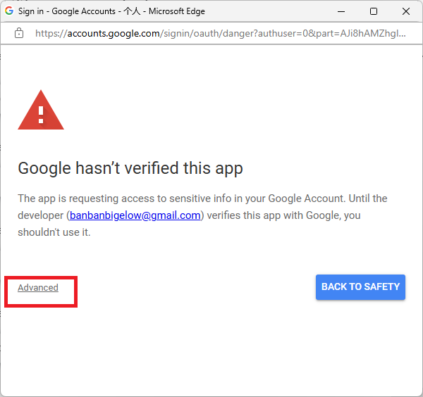 |
| 認証③ | 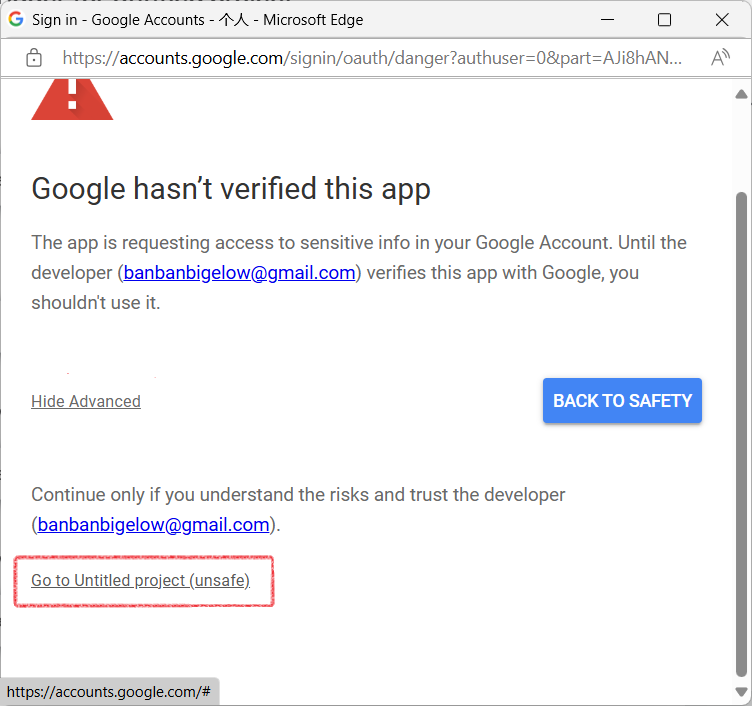 |
| 認証④ |  |


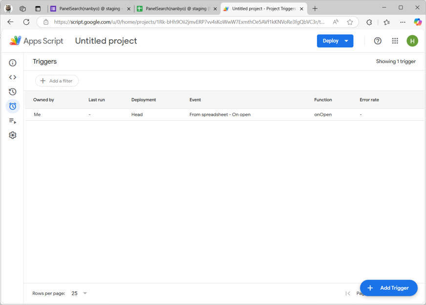
> ✅ Menu用Triggerが作成されました。

---

#### ② on Form Submit Trigger

Google Form側で新規登録があった場合に実行されます。
 


---

#### ③ Check Status Trigger（定期チェック用）
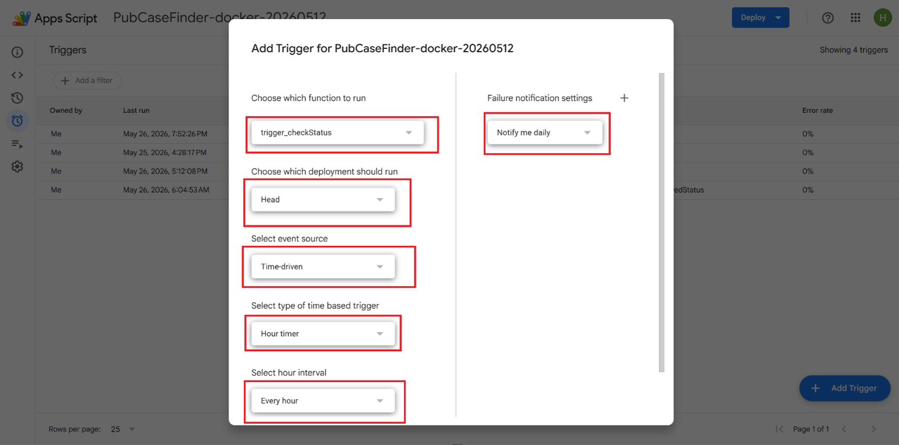
このTriggerは、定期的にPubcasefinderサーバからユーザーの状態変更を取得し処理を行います。

**処理内容：**
- 退会したユーザーは、Google FormのResponseListから該当Responseを削除


**設定項目：**
| 項目 | 説明 |
|---|---|
| Select type of time based trigger | 定期実行の間隔タイプを選択 |
| Select hour interval | 実行間隔（時間）を設定 |

> 💡 設定値はご自由に調整してください。

---

#### ④ Authentication Expiration Check Trigger

認証の有効期限をチェックするTriggerです。

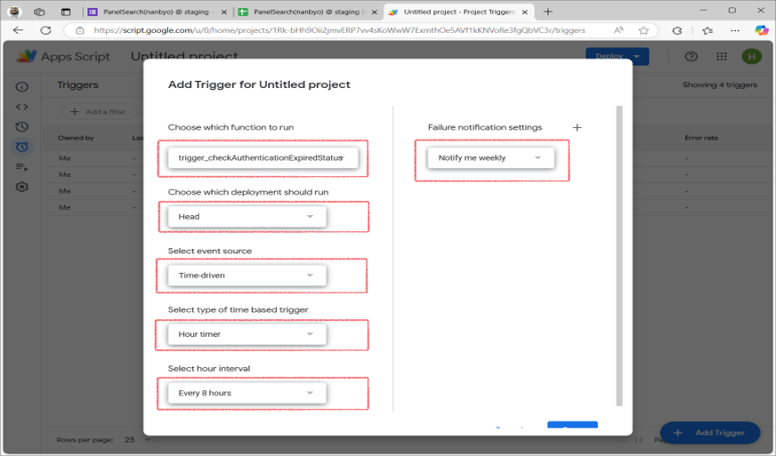

---

## 設定完了

以上で全ての設定が完了です。


---

**四、ユーザー登録の例と指定ユーザーが管理者にする方法**

### 1. ユーザーGoogleFormよりPubcasefinder共通用版登録の例  
   (1) DiseaseSearch、CaseSharing、Panelsearch各サービス画面に、「Login」ボタンで、GoogleSignUpへリンクをあけます  
   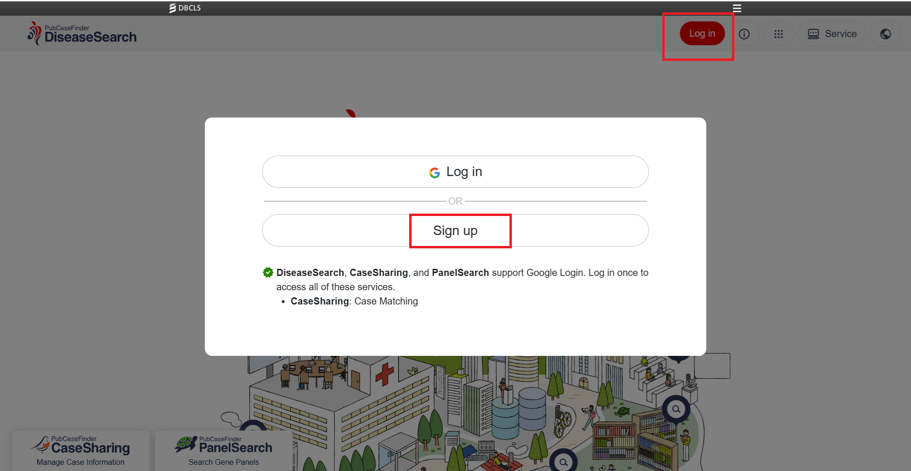  
   
   (2) Google Formに記入して、Submitする  
   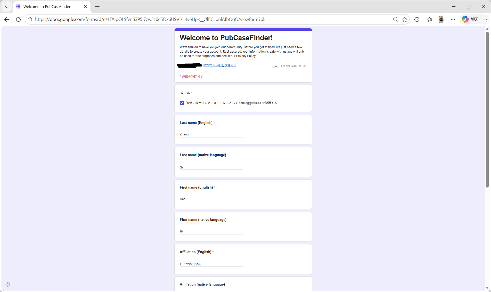    
   
   (3) ユーザーがGoogleFormに記入したaffiliation email addressで、email authenticationを行い  
   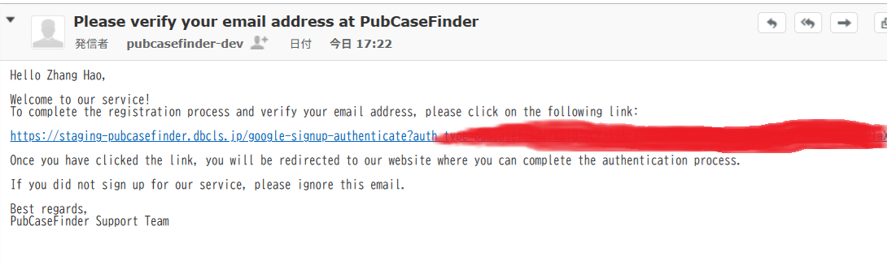    
   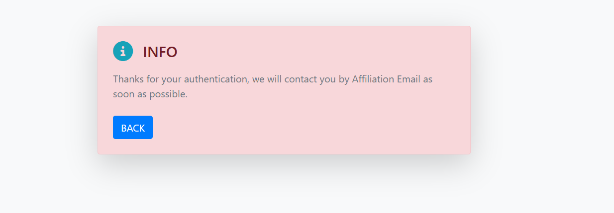    
   
   (4) 完了  
   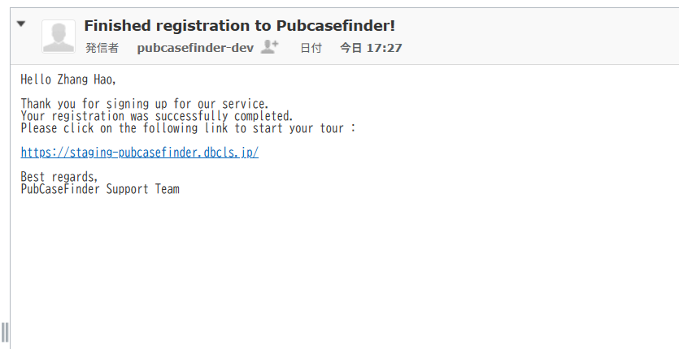  

### 2. 指定ユーザーに管理者権限を付与する方法

管理者権限（`user_type = 3`）を特定のユーザーに付与するには、以下の手順で SQL を実行します。

> [!WARNING]
> - 実行前に、対象ユーザーの Google ID（`google_id`）を**必ず実際の値に置き換えて**ください。
> - 本番環境で実行する場合は、事前にユーザー情報をバックアップすることを推奨します。

#### 手順 1: SQL ファイルの作成

`mysql/scripts/` ディレクトリ内に `set_admin.sql` という名前でファイルを作成し、以下の内容を記述します。

```sql
-- 対象ユーザーを管理者（user_type = 3）に更新
UPDATE user_account
SET user_type = 3
WHERE google_id = 'ここに対象ユーザーのGoogleアカウント（メールアドレス）を入力';

```

#### 手順 2: DockerコンテナでSQLを実行
以下のコマンドを実行して、SQLファイルをMySQLに適用します。

```bash
docker compose exec -T mysql sh /scripts/exec_sql_file.sh /scripts/set_admin.sql
```
